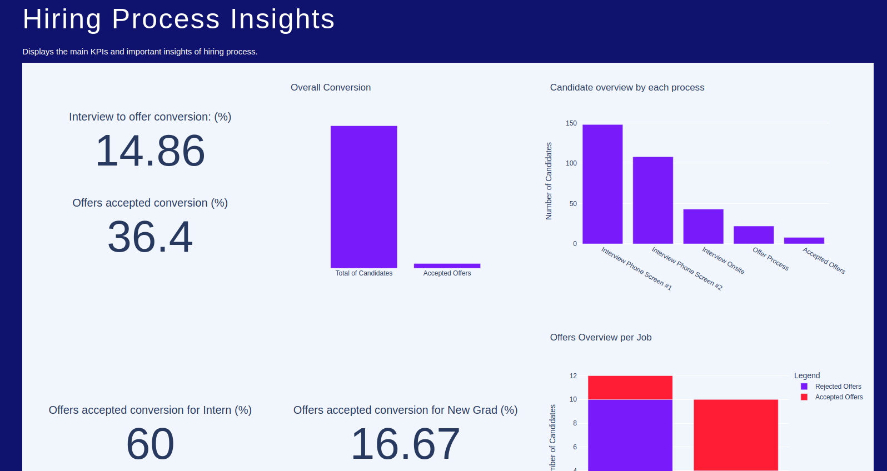

# I- Introduction of Hiring

The typical recruiting pipeline looks something like this:
1. Recruiter Phone Screen (optional)
2. Phone Screen #1
3. Phone Screen #2
4. Onsite
5. Offer
6. Offer Accept


Because of interview performance and other factors, the shape of this pipeline looks like a funnel 


The Onsite round contains 4 interview questions: 
- Onsite Coding Question #1
- Onsite Coding Question #2
* 2 Onsite Value Fit Question *(the A/B/C/D prefix are used to denote different Value Fit Questions asked by different interviewers)*


Note that some interviews have multiple engineers conducting them, so you might see 2 “Phone Screen #1”s for the same candidate. 

The aim is to answer to the question:

**How we can improve university recruiting for future seasons?**


1. KPI Creation - How should we evaluate whether this University Recruiting season went well?  
2. Advice A - What can we do to improve University Recruiting in the future?
3. Advice B - What can we do to improve our interviewing process?


##### The client of this analysis is the **Head of Engineering** to help them understand how well the university recruiting season has been going, and what we can do better for future seasons. 

### What's the data

1. interviews: a table that contains interview feedback for many intern and new grad candidates
2. tags: : a table that contains candidates and tags for where the candidate was sourced 
3. offers: a table that contains candidates who received offers
4. offer_accepts: a table that contains candidates that accepted their offers

## II- Results


### Before to start

- ```git clone git@github.com:MatthieuRu/hiring-process-analysis.git``` *Git clone the project from Github.*
- ```./start.sh``` *Launch the docker images including the postgre server*
- ```conda env create``` *Create the conda environment based on the environment.yml.*
- ```conda activate hiring-process``` *Activate the conda environment.*
- ```jupyter notebook README.ipynb``` *Create the schema and migrate the data from csv to the postgre database*
- ```python app.py``` *Run the app on your local machine*


### 1. Create the database & Run the app

A Postgre database is runing on a docker container and a app Hiring Process Insights has been created.


```python
from src.hiring_process_analysis.db_manager.server import Server
# Connection to the server
server = Server(
    ip='0.0.0.0',
    user='application',
    passwd='secretpassword',
    database='application'
) 
```

```python
# Delete the schema (if needed)
server._delete_schema()
```

```python
# Create the schema
server._create_schema('src/hiring_process_analysis/db_manager/hiring_process.sql')
```

```python
from src.hiring_process_analysis.db_manager.migration import Migration
import pandas as pd

## Load the different files and send them to the databases
migration = Migration(
    interview=pd.read_csv('./assets/interviews.csv'),
    candidate_tags=pd.read_csv('./assets/candidate_tags.csv'),
    offer_accepts=pd.read_csv('./assets/offer_accepts.csv'),
    offers=pd.read_csv('./assets/offers.csv'),

)

migration.send_to_databases(server=server)
```

Now you can run the app:

- ```python app.py``` *Run the app on your local machine*




### 2 - Get the differents KPI tables from the database

All the SQL query has been added to a function file. Each function is a query returning a pandas dataframe. (All the table needed for the analysis and the **app**.

```python
from src.hiring_process_analysis.db_manager.get_kpi import get_kpi_conversion_overall
from src.hiring_process_analysis.db_manager.get_kpi import get_kpi_conversion_details
from src.hiring_process_analysis.db_manager.get_kpi import get_kpi_offers
from src.hiring_process_analysis.db_manager.get_kpi import get_onsite_question_overview
from src.hiring_process_analysis.db_manager.get_kpi import get_tag_candidate_overview
from src.hiring_process_analysis.db_manager.get_kpi import get_inferviews_table

# Get from the server to a DataFrame
kpi_convertion_overall = get_kpi_conversion_overall(server)
kpi_conversion_details = get_kpi_conversion_details(server)
kpi_offers = get_kpi_offers(server)
onsite_question_overview = get_onsite_question_overview(server)
tag_candidate_overview = get_tag_candidate_overview(server)

```

### 3 - Get the differents Graph and Indicators from the KPI tables

A Class has been created containing all the graph and indicators needed for the analysis and the **app**.

```python
from src.hiring_process_analysis.app.vizualisation import Vizualisation

# Class with all information needed
vizualisation = Vizualisation(
        get_kpi_conversion_overall(server),
        get_kpi_conversion_details(server),
        get_kpi_offers(server),
        get_onsite_question_overview(server),
        get_tag_candidate_overview(server),
        get_inferviews_table(server)
)

# Example
vizualisation.kpi_conversion_overall_graph
```
